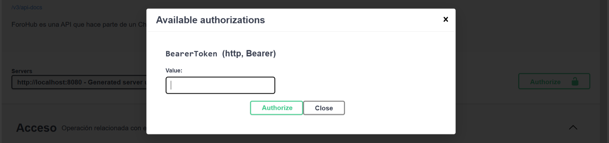

# ForoHub

## Tabla de contenido

1. [Descripción](#descripción)
2. [Funcionalidad](#funcionalidad)
3. [Uso](#uso)

### Descripción

**`Este es un proyecto hecho en IntelliJ IDEA con el lenguaje de programación de Java y con la herramienta de desarrollo de
aplicaciones web Spring Boot. ForoHub da solución a un Challenge propuesto por Alura Latam y Oracle Next Education. La
documentacion fue hecha con Spring Doc.`**

### Funcionalidad

1. Para empezar a usar la API, se debe crear un usuario en el endpoint de Registro. El usuario debe incluir un nombre,
   un
   correo electrónico y una
   clave.

2. Luego debe ingresar el correo electrónico y la clave que utilizó en el registro en el endpoint de
   acceso.

Si el usuario es autenticado, recibirá un JWT (Json Web Token) con el que podrá hacer
las
request en los endpoints que soliciten autenticación.

3. El JWT es necesario para varios endpoints. Por lo que debe ingresarse en los Request para que funcionen.
   correctamente.

 

4. El bloque de tópicos tiene los endpoints para:

- Crear un nuevo tópico.
- Actualizar los datos de un tópico.
- Listar los tópicos creados.
- Ver todos los datos de un tópico.
- Eliminar un tópico.

5. El bloque de Respuestas tiene los endpoints para:

- Crear una nueva respuesta.
- Actualizar los datos de una respuesta.
- Listar las respuestas creadas.
- Ver todos los datos de una respuesta.
- Eliminar una respuesta.

6. El bloque de usuario tiene los endpoints para:

- Actualizar los datos de un usuario.
- Listar los usuarios registrados.
- Eliminar un usuario.

### Uso

**`Los cursos y roles ya están predefinidos dentro de la aplicación.`**

**_Cursos_**

| id | nombre                           | categoría   |
|----|----------------------------------|-------------|
| 1  | Programación Orientada a Objetos | C           |
| 2  | Estructuras de Control           | C_SHARP     |
| 3  | Desarrollo Móvil                 | JAVA        |
| 4  | Desarrollo Web                   | JAVA_SCRIPT |
| 5  | Inteligencia Artificial          | PYTHON      |
| 3  | Consultas Avanzadas              | SQL         |

**_Roles_**

| id | nombre        |
|----|---------------|
| 1  | Administrador |
| 2  | Usuario       |

El usuario puede generar tópicos o respuestas y estos quedarán registrados en la base de datos.