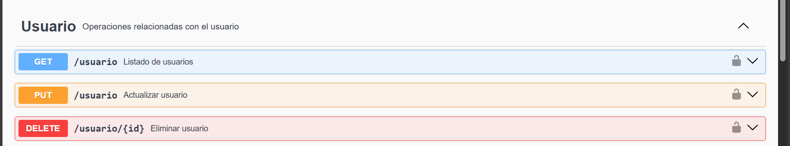
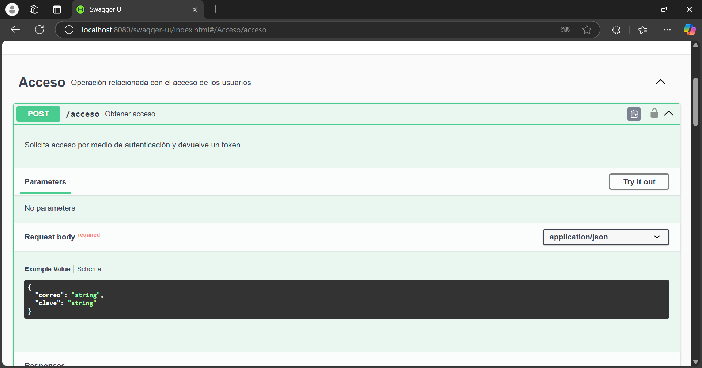

# ForoHub

## Tabla de contenido

1. [Descripción](#descripción)
2. [Funcionalidad](#funcionalidad)
3. [Uso](#uso)

### Descripción

- `Este es un proyecto hecho en IntelliJ IDEA con el lenguaje de programación de Java y con la herramienta de desarrollo
  de aplicaciones web Spring Boot. ForoHub da solución a un Challenge propuesto por Alura Latam y Oracle Next Education`.

### Funcionalidad

1. Para empezar a usar la API, se debe crear un usuario. El usuario debe incluir un nombre de usuario, un correo y una
   clave. 

### Uso